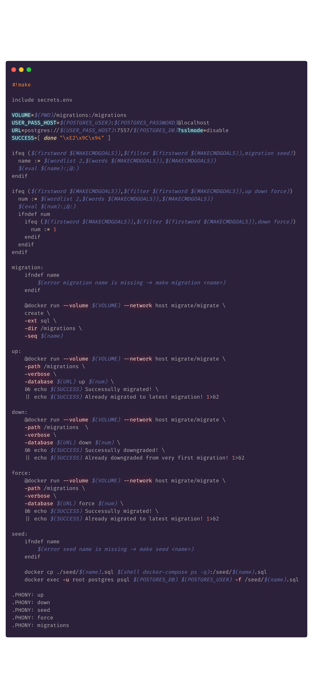

# go-migrate postgres helper

[Documentation](https://github.com/golang-migrate/migrate/blob/master/GETTING_STARTED.md)

Requirements:

- `docker`
- `docker-compose`

File Preview:

```
├── Makefile
├── README.md
├── docker-compose.yml
├── migrations
│   ├── 000001_create_users_table.down.sql
│   ├── 000001_create_users_table.up.sql
│   ├── 000002_add_age_to_users.down.sql
│   └── 000002_add_age_to_users.up.sql
└── secrets.env

```

## Usage

Start the postgres database

```
docker-compose up -d
```

### 1. Create a migration

```
make migration <migration_name>
```

### 2. Then add SQL to both up & down migrations files.

For example:

```sql
-- 000001_create_users_table.up.sql

CREATE TABLE users (
    name varchar(50)
)
```

```sql
-- 000001_create_users_table.down.sql
DROP TABLE users;
```

### 3. Migrate to latest migration

```
make up
```

### Migrate up a number

```
make up <number>
```

### Migrate down 1

```
make down
```

### Migrate down a number

```
make down <number>
```

### Handling errors: resolving a dirty database

A migration script can fail because of invalid syntax in sql files making a database dirty
[Github issue](http://bit.ly/2HQHx5s).

To fix this, force down 1, to the last working migration.

1. `make force`
2. fix the syntax issue
3. then run `make up` again

**NOTE:** If you already have postgres running on port 5432 on your host machine, map the host port to something else.
In the docker-compose.yml file, this has already been done. `7557:5432` represents the `<hostPort:containerPort>` mapping.

```
version: "3.7"

services:
  postgres:
    image: postgres:11.6
    env_file: ./secrets.env
    ports:
      - 7557:5432
```


